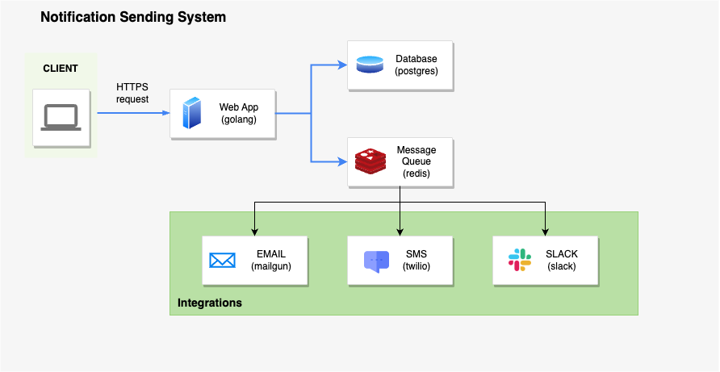

# notifire

Notification Sending System responsible for delivering notifications or messages to recipients through various communication channels.

## Design



The notification sending system consists of the following components:

* Web App: REST API implemented in golang which receives and sends the notifications for processing.
* Database: A PostgreSQL database is used to store the notifications. It retains metadata and status information about each notification, enabling tracking and auditing of the notification sending process.
* Message Queue: A message queue implemented using Redis Streams. It acts as a buffer for storing notifications before they are sent to their respective channels.
* Integrations: External services which specializes in processing notifications by channel.
  * Email Integration (mailgun): An email delivery service that provides an API for sending emails. It consumes email notifications from the Redis Stream and sends them as email messages to the specified recipients.
  * SMS Integration (twilio): An external service that specializes in sending SMS messages. It consumes SMS notifications from the Redis Stream and sends them as SMS messages to the intended recipients.
  * Slack Integration (slack): A service or API integration with the Slack messaging platform. It consumes notifications from the Redis Stream and sends them as messages to the designated Slack channels.

## Installation

* add env values in ```docker-compose.yaml```
* install the service
    ```bash
    $ docker-compose up --build -d
    ```
